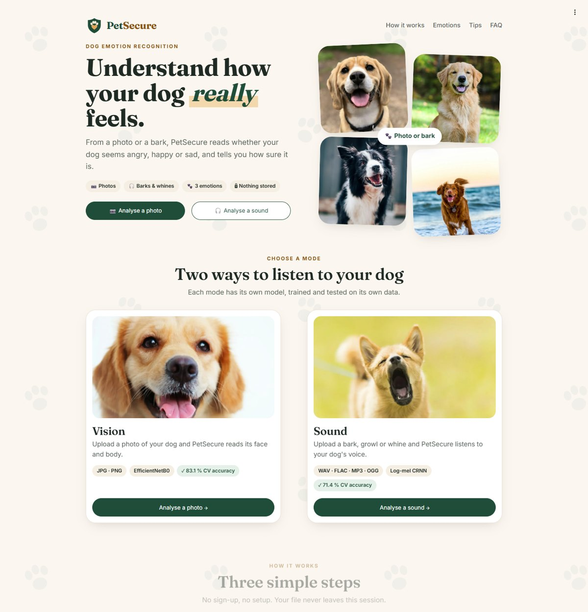
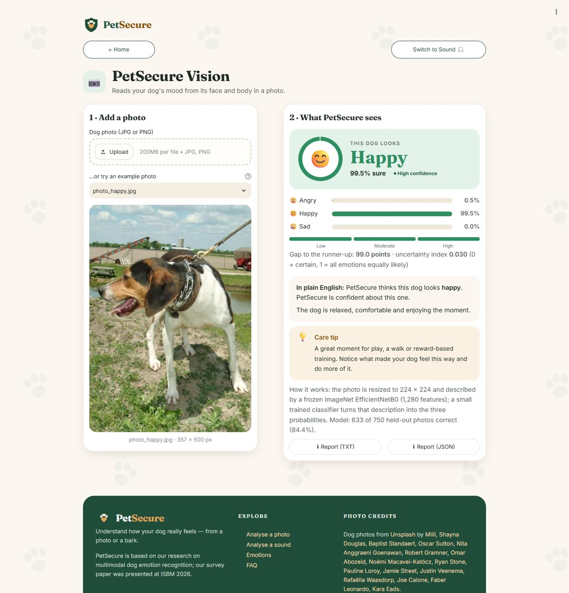
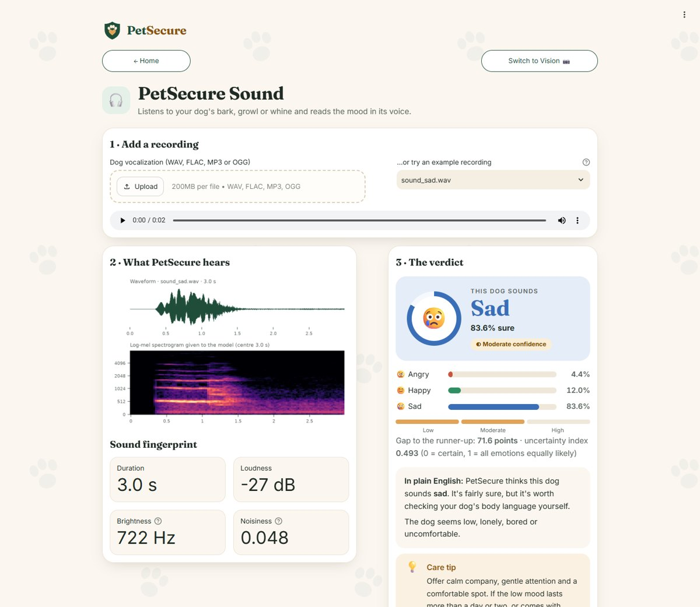
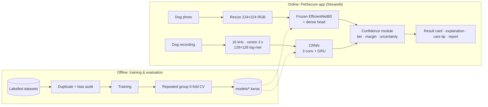

<div align="center">

# 🐾 PetSecure

**Understand how your dog really feels — from a photo or a bark.**

Deep-learning web app that recognises whether a dog is **angry, happy or sad** from a photograph *or* a vocalization, and tells you **how sure it is**.

**▶ Try it live: [petsecure.streamlit.app](https://petsecure.streamlit.app)** (free server, so it may take a minute to wake up)

[](https://petsecure.streamlit.app)
[](https://github.com/VirenSawant07/petsecure/actions/workflows/ci.yml)




</div>

---

## The problem

Dogs show stress, fear and aggression through their face, body and voice long before it becomes a welfare or safety problem. People often misread these signals. Existing research systems have three gaps:

1. They use **only photos**.
2. They report accuracy on a **single, often optimistic, test split**.
3. They return a **bare label**, with no sign of how reliable it is.

PetSecure addresses all three.

## What it does

- **Vision mode**: upload a dog photo (JPG/PNG). A frozen ImageNet **EfficientNetB0** plus a small trained classifier predicts the emotion.
- **Sound mode**: upload a bark, growl or whine (WAV/FLAC/MP3/OGG). The clip becomes a 128 × 128 **log-mel spectrogram** that a compact **CRNN** (convolutional recurrent network) classifies.
- **Honest confidence** on every answer:
  - a High / Moderate / Low tier;
  - the gap between the top two predictions;
  - an uncertainty index (normalised entropy).
- **Plain-English explanation and a care tip** for the predicted emotion.
- **"What the model hears"**: the exact spectrogram fed to the network, plus simple sound measurements.
- **Downloadable reports** (TXT / JSON). Uploads are processed in memory and never stored.

| Vision result | Sound result |
|---|---|
|  |  |

## Results

All numbers come from **repeated stratified five-fold cross-validation**: 3 repetitions, 15 test folds per model. Near-duplicate photos are kept in the same fold, and models are never selected on test data.

| | Photo model (EfficientNetB0, frozen) | Sound model (CRNN, corrected input) |
|---|---|---|
| Accuracy | **83.1 % ± 1.8** | **71.4 % ± 8.7** |
| Macro-F1 / AUC | 0.831 / 0.943 | 0.706 / 0.858 |
| Parameters | 4.4 M (0.33 M trained) | 85 k |
| CPU latency (model only, batch 1) | 21 ms | 7 ms |

- **Confidence you can use:** photo predictions marked *High* were correct **91.5 %** of the time, against **55.2 %** for *Low*. Expected calibration error is 0.048.
- **Data:** 3,750 dog photos (1,250 per class) and 113 emotion-labelled vocalizations. We also collected 1,980 more dog recordings, which are not yet emotion-labelled.
- **Compared models:** 8 architectures (5 image, 3 audio), with 11 variants cross-validated.

### What we found along the way
- **The first image models were silently broken** (31–36 %, predicting a single class). There were three root causes:
  - pixels were scaled by 1/255 twice;
  - all layers were fine-tuned at a high learning rate on 3,000 images;
  - a model saved as "MobileNet" was actually VGG16.
  
  After the fixes, the same backbones on the same 750 test photos score **80–82 %**.
- **The audio input was scrambled.** `np.resize` truncated the spectrogram instead of resizing it. The corrected front end (16 kHz, centre 3 s window, exactly 128 frames) gave the CRNN **+8.5 points**.
- **The audio labels carry a recording-source bias.** A depth-3 decision tree that sees only each file's sampling rate and duration predicts the label with **86.8 %** accuracy. Audio results are therefore reported as upper bounds.

## Architecture



## Quick start

**Use it online:** open [petsecure.streamlit.app](https://petsecure.streamlit.app). Nothing to install.

**Run locally** (Python 3.12):
```bash
git clone https://github.com/VirenSawant07/petsecure.git
cd petsecure
python -m venv .venv
.venv\Scripts\activate          # Windows  (macOS/Linux: source .venv/bin/activate)
pip install -r requirements.txt
streamlit run app.py
```
Then open http://localhost:8501 and try the built-in examples.

**Run with Docker:**
```bash
docker build -t petsecure .
docker run -p 8501:8501 petsecure
```

## Project structure

```
petsecure/
├── app.py                 Streamlit front end: pages, uploads, results
├── ui.py                  Styles, logo and page sections
├── inference.py           Model loading, pre-processing, prediction, confidence (no UI code)
├── models/                Trained models + their hold-out scores
├── examples/              Held-out demo photos and recordings
├── static/                Fonts, WebP photos, favicon (served by Streamlit)
├── training/              Scripts that train the two deployed models
├── research/              Evaluation code and every result file behind the numbers above
├── notebooks/             Original exploratory notebooks (including the first, flawed runs)
├── tests/                 pytest: confidence, audio front end, model smoke tests, headless app tests
├── data/README.md         Expected dataset layout (datasets are not committed)
├── .github/workflows/     CI pipeline
└── Dockerfile
```

## Testing & CI

On every push and pull request, GitHub Actions runs:

| Job | What it checks |
|---|---|
| **Lint** | `ruff check .` |
| **Tests** | 19 pytest tests: confidence rules, spectrogram shape, both models on held-out examples, and the Streamlit pages rendered headlessly with `AppTest` |
| **Security** | `pip-audit` on the runtime dependencies |
| **Docker** | Builds the image, starts it, and waits for Streamlit's `/_stcore/health` endpoint |

Run the same checks locally:
```bash
pip install -r requirements-dev.txt
ruff check .
pytest -q
```

## Reproducing the models and results

1. Put the datasets in `data/` as described in [`data/README.md`](data/README.md).
2. Retrain the deployed models:
   ```bash
   python training/train_image_model.py
   python training/train_audio_model.py
   ```
3. The evaluation pipeline (cross-validation, bias probe, calibration, latency, figures) is in [`research/`](research/README.md).

## Limitations & next steps
- **Small, source-biased audio set.** Next: record all classes under the same conditions, label the 1,980 extra clips, and try pretrained audio embeddings (PANNs).
- **The sound model is weak on angry vocalizations** (often predicted as happy). Collecting more angry recordings is the first priority.
- **No paired photo-and-sound data yet**, so the two modes are not fused. Next: collect short videos of the same dog and learn the fusion.
- **Explainability:** add Grad-CAM for photos and highlighted spectrogram regions for sounds.
- **Deployment:** TensorFlow Lite for mobile, and eventually the smart-collar design proposed in our survey.

PetSecure gives a probabilistic reading and is **not a substitute for a vet**.

## Team & publication

Final-year B.Tech. project, Department of Computer Engineering, JSPM's Rajarshi Shahu College of Engineering, Pune (2026–27).

- **Team:** Samarth Gondukupi · Tanmesh Choudhary · Viren Sawant · Pushkar Panzade
- **Guide:** Dr. Seema V. Kedar · **Co-guide:** Prof. Rutuja Khedkar
- **Survey paper:** *A Comprehensive Survey of Multimodal Emotion Recognition for Dogs: Vision, Audio, Wearables*. Presented at the 5th World Conference on Information Systems for Business Management (ISBM 2026), Bangkok, September 2026 (publication partner: Springer Nature).

## Credits & licence
- **Code:** [MIT](LICENSE).
- **Photos:** dog photos in `static/img` are from [Unsplash](https://unsplash.com) (Unsplash License). Photographers are listed in `static/img/credits.json` and in the app footer.
- **Fonts:** Fraunces and Inter (SIL Open Font License).
